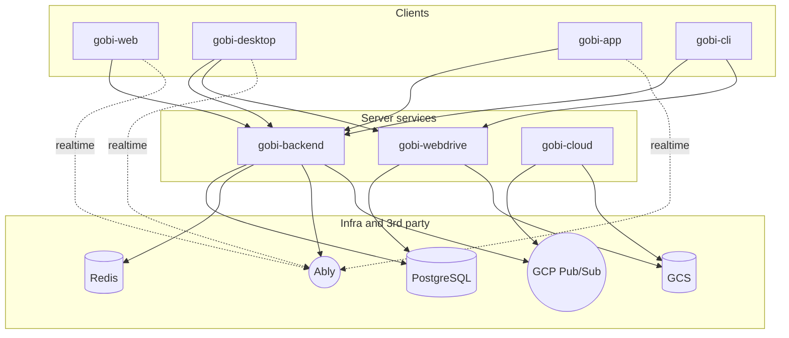

Gobi is built as **seven loosely-coupled projects** organized into clients (what users touch) and server services (what runs them). Each project has its own stack and release cadence, joined by a small set of shared contracts: REST + WebSocket against `gobi-backend`, Ably for real-time pub/sub, and JWTs minted by the backend that downstream services trust.

## Ecosystem at a glance

Solid arrows are request/response or sync; dashed arrows are pub/sub channels.

## Projects

| Project | Role | Stack |
|---------|------|-------|
| **gobi-web** | Browser app for Gobi Space, Home, Second Brain Agent, and Gobi Agent surfaces | Next.js 16, React 19, Zustand, SCSS |
| **gobi-desktop** | Local-first creator tool — the richest client; owns vault, sync, voice, capture, agent, automation, terminal | Electron 38, React 19, Vite, Biome |
| **gobi-app** | Flutter mobile app — ambient capture, wearable companion, push notifications | Flutter (Dart ≥3.2.3), Riverpod, go_router |
| **gobi-cli** | Programmatic access for agents and power users; mirrors what the desktop and web clients can do | TypeScript, Commander.js, Node ≥18 |
| **gobi-backend** | Core REST/WebSocket API — identity, billing, threads, real-time, voice, integrations | NestJS 10, TypeORM, PostgreSQL, Redis |
| **gobi-webdrive** | File sync, agent runtime pool (Docker-isolated Claude Code per vault), digital-garden hosting | Python (Flask + Quart), GKE |
| **gobi-cloud** | Async data processing — audio VAD, frame analysis, location, batch jobs | Python ≥3.12, uv, Pub/Sub, GKE |

## Where capabilities live

Most product features cross multiple projects. A few clarifying rules of thumb:

- **Identity & social data** — users, threads, brain updates, spaces, billing — live in `gobi-backend` (PostgreSQL).
- **Files & vault state** — live in `gobi-webdrive` (sync metadata in PostgreSQL, file bytes on a shared GKE volume / GCS).
- **Agent runtime** — for the embedded Second Brain Agent — runs in `gobi-webdrive`'s agent pool, isolated per vault.
- **Async processing** — anything bursty or model-adjacent (audio VAD, frame inference, scheduled batch jobs) — runs in `gobi-cloud` and reads/writes through PostgreSQL, BigQuery, and GCS.
- **Real-time** — Ably is the publish/subscribe channel; `gobi-backend` is the only publisher, every client subscribes.

## Why split this way

Three different operational profiles need three different runtimes:

- **Stateless API** (`gobi-backend`) — short-lived requests, predictable resource use, multi-region Cloud Run.
- **File and runtime layer** (`gobi-webdrive`) — long-lived containers, filesystem I/O, per-vault isolation.
- **Bursty ML pipeline** (`gobi-cloud`) — GPU-adjacent, optional heavy dependencies (PyTorch, vision models), Pub/Sub-driven.

Co-locating these in a single service would force the worst trade-offs of each.

## Shared contracts

- **JWT auth** — `gobi-backend` mints tokens; `gobi-webdrive` shares the same `JWT_SECRET` and validates them. There is no separate identity layer in webdrive or cloud.
- **Cursor-based file sync** — `gobi-desktop` and `gobi-cli` speak the same delta-sync protocol against `gobi-webdrive`. See [How sync works](/developers/sync).
- **Capture types** — Audio, Vision, Motion, Notes — are the canonical taxonomy across every client and the cloud pipeline.
- **Pub/Sub envelopes** — `gobi-cloud` callbacks consume strongly-typed message bodies; the harness (`gobi_cloud/bin/harness.py`) handles ack/nack and observability.

<Info>
  See [How sync works](/developers/sync) for the file-sync protocol and [Privacy & data flow](/developers/privacy-and-data-flow) for what leaves the Vault and when.
</Info>
