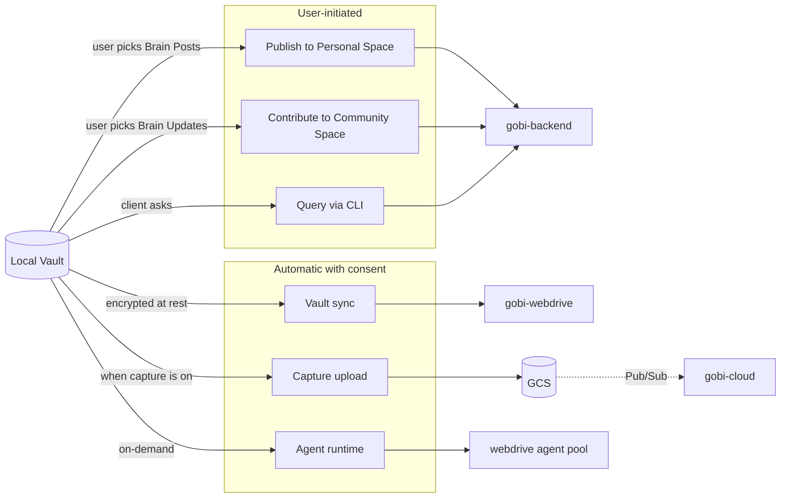

Gobi is **local-first by default**. Your Vault — the storage layer for everything you've captured — sits on your device. Data only leaves when an explicit action moves it across a boundary.

This page diagrams those boundaries and names what crosses them.

<Info>
  This is a "how data moves" page, not a legal/policy page. For binding terms, see [Privacy Policy](https://gobihq.com/privacy) and [Terms of Service](https://gobihq.com/terms).
</Info>

## What leaves the Vault, and when

Five paths cross the local boundary:

- **Personal Space publish** — a user explicitly selects a Brain Post or surfaces their Public Brain Graph. Nothing else from the Vault is touched.
- **Community Space contribute** — a user shares a Brain Update with a community. The agent prepares the contribution; the user confirms.
- **CLI query / write** — third-party agents and scripts authenticated as the user can read and write through `gobi-backend`. Same permission model as the desktop client.
- **Vault sync** — `gobi-desktop` and `gobi-cli` mirror the local Vault to `gobi-webdrive` so the user can roam across devices and use the embedded agent. See [How sync works](/developers/sync).
- **Capture upload** — when capture is enabled, the client uploads Audio / Vision / Motion blobs to GCS. `gobi-cloud` consumes these via Pub/Sub for VAD, frame analysis, and timeline construction.

## Trust boundaries

Three boundaries you should know about as a developer:

### 1. Identity is owned by `gobi-backend`

`gobi-backend` is the only service that mints JWTs. `gobi-webdrive` and `gobi-cloud` validate tokens but do not issue them. There is no separate auth layer to bypass.

### 2. Agent sessions are isolated per Vault

The Second Brain Agent runs inside `gobi-webdrive`'s agent pool. Each session gets its own Docker-isolated Claude Code container (`USE_DOCKER_ISOLATION=true`). A misbehaving tool call has bounded blast radius — it cannot reach across vaults or escape into the host.

### 3. Cloud processing is one-way for capture

`gobi-cloud` reads capture blobs and writes structured results back into PostgreSQL / BigQuery. Clients see results only after the backend reads them. There is no direct client → cloud channel.

## What does **not** leave the Vault

- Files you never explicitly share or sync — including drafts, private notes, and anything in vault subdirectories you've excluded via `.gobi/syncfiles`.
- The full Brain graph (only the Public Brain Graph is publicly visible, and the user controls its surface).
- Capture data when capture is off.

<Info>
  See [How sync works](/developers/sync) for the protocol details and [Architecture](/developers/architecture) for how the services fit together.
</Info>
