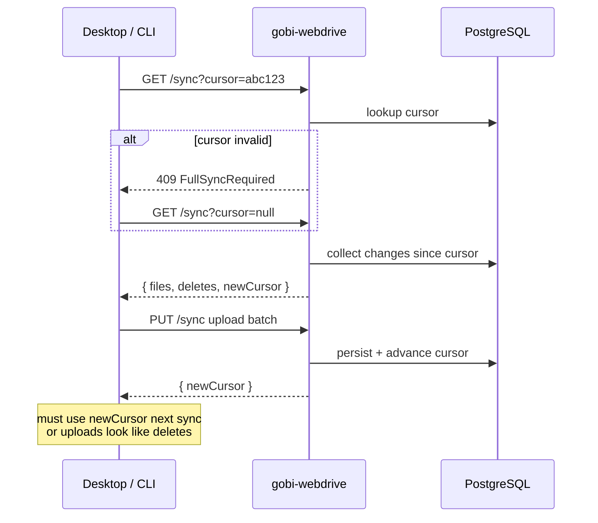

`gobi-desktop` and `gobi-cli` keep their local vault in step with the server-side vault using a **cursor-based delta sync** protocol against `gobi-webdrive`. The cursor is a server-issued opaque token that represents "what state of the vault you last saw."

This page documents the protocol's contract and its sharp edges. If you're building a third-party tool that talks to webdrive, this is what you need to get right.

## The shape of one sync



Two phases: a **read** (what changed since I last asked) and a **write** (here's what I changed locally). Each returns a fresh cursor — the client must persist that cursor before the next sync.

## Sharp edges

These are the protocol's "easy to get wrong" points. Most third-party sync bugs come from one of these.

### Invalid cursor → `409 FullSyncRequired`

If the server can't resolve your cursor (it's malformed, expired, or from a different vault), it returns `409 FullSyncRequired`. The client must retry with `cursor=null` to fetch the full state.

This is not an error condition — it's a normal recovery path. Build for it.

### Stale cursor after upload

After a successful upload batch, the server returns a new cursor. **Use it on the next sync.** If you reuse the cursor you sent for the *read* phase, the just-uploaded files will look "missing relative to your view" and the next delta will mark them as deletes.

Persisting the post-upload cursor is the most-violated invariant in sync clients.

### `.gobi/syncfiles` is special

This file is **never** present in the `files` array. Clients should track its presence and content via the `syncfilesHash` field on the response, not via the regular file listing.

### Patterns must start with `/`

Sync patterns (whitelist/blacklist entries in `.gobi/syncfiles`) must start with `/`. Anything else returns `400 Bad Request`. There is no implicit anchoring.

### Conflict format

When two writers touch the same file, the loser is renamed to:

```
{name}.conflict.{mtime}.{ext}
```

For example: `meeting-notes.conflict.1714291200.md`. Clients should surface these to users — they represent ambiguity that automatic resolution can't decide.

## Reference

- The canonical sync spec lives in the monorepo at `gobi-webdrive/webdrive/SPEC.md`.
- The `@gobi-ai/cli` package implements this protocol — its source is a working reference.
- Endpoints are gated by JWTs minted by `gobi-backend`; see [Architecture](/developers/architecture) for the auth boundary.
